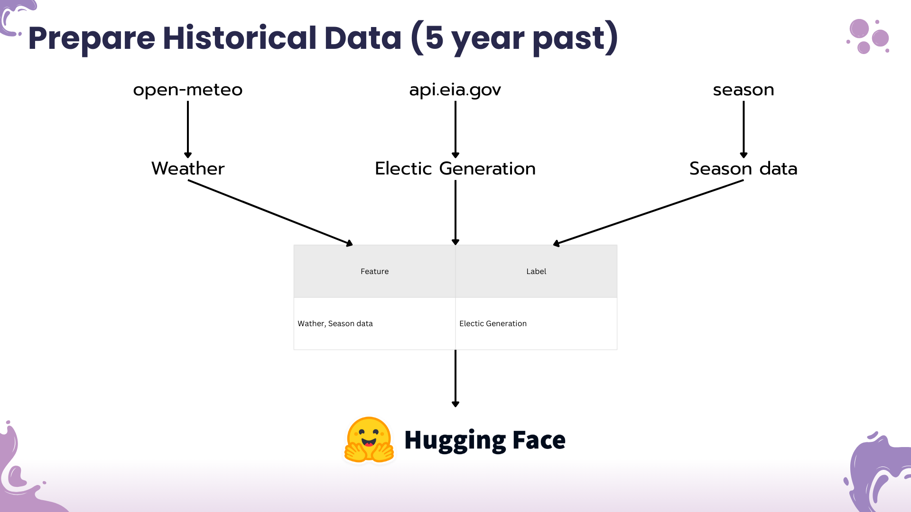
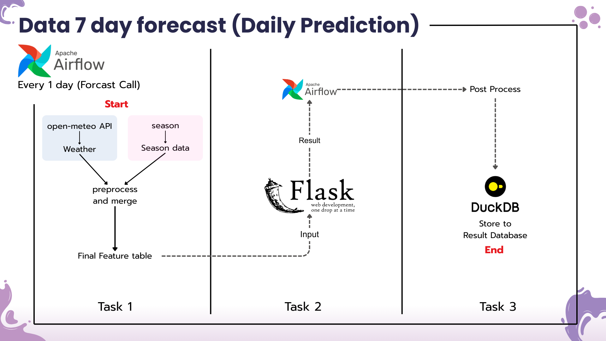
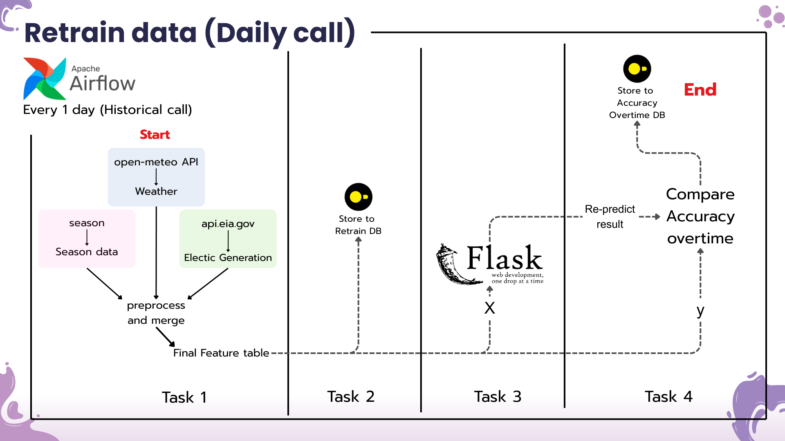

# REG-Forecasting

A forecasting system for renewable energy (Solar and Wind) prediction using LSTM and GRU deep learning models.


## Member
*NATTHINAN KERDSRI - GRU developer* <br>
*WACHIRAWIT PREMTHAISONG - Project Manager & Data Engineering* <br>
*NAPADECH KAEWNOK - LSTM developer* <br>

## 🎯 Overview

REG-Forecasting is a comprehensive system for predicting renewable energy generation (solar and wind power). It uses:

- **LSTM (Long Short-Term Memory)** - For sequence-to-sequence forecasting
- **GRU (Gated Recurrent Unit)** - For efficient temporal modeling
- **Apache Airflow** - For pipeline orchestration and scheduling
- **Flask API** - For serving predictions in real-time
- **DuckDB** - For efficient data management and queries

The system automatically fetches weather data, processes it, trains/retrains models, and provides forecasting through a REST API.

## Data pipeline

### 1. Call 5 year historical data


### 2. Daily Predict 7-14 Day forecast


### 3. Call retrain data (1-2 day delay)


## 📁 Project Structure

```
REG-Forecasting/
├── jupyter/                              # Jupyter notebooks for data science
│   └── DataScience/
│       ├── GRU/                         # GRU model experiments
│       │   ├── GRU_Solar.ipynb
│       │   └── GRU_Wind.ipynb
│       └── LSTM/                        # LSTM model experiments
│           ├── LSTM__solar.ipynb
│           └── LSTM_wind.ipynb
│
├── pipeline/                             # Airflow pipeline orchestration
│   ├── dags/                            # Airflow DAGs
│   │   ├── call_retrain_data_pipeline_gru.py
│   │   ├── call_retrain_data_pipeline_lstm.py
│   │   ├── forecast_pipeline_gru.py
│   │   └── forecast_pipeline_lstm.py
│   ├── db/                              # Database utilities
│   │   ├── call_api.py
│   │   ├── duckdbcon.py
│   │   └── helper.py
│   ├── functions/                       # Data processing functions
│   │   ├── electic.py
│   │   ├── merge_df.py
│   │   ├── seasonal.py
│   │   ├── variable.py
│   │   └── weather.py
│   ├── jobs/                            # Individual pipeline tasks
│   │   ├── fetch_retrain_data.py
│   │   ├── fetch_weather.py
│   │   ├── load_to_duckdb.py
│   │   ├── compare_accuracy_overtime.py
│   │   ├── re_predict_data_gru.py
│   │   ├── re_predict_data_lstm.py
│   │   ├── store_retrain_data.py
│   │   ├── weather_predict_gru.py
│   │   └── weather_predict_lstm.py
│   ├── docker-compose.yml
│   ├── Dockerfile.airflow
│   └── requirements.txt
│
├── server/                               # Flask prediction server
│   ├── server.py                        # Main Flask application
│   ├── db/                              # Database helpers
│   │   ├── duckdbcon.py
│   │   └── helper.py
│   ├── logic/                           # Model prediction logic
│   │   ├── gru_solar.py
│   │   ├── gru.py
│   │   ├── retrain_data.py
│   │   ├── solar_gru.py
│   │   ├── solar_lstm.py
│   │   ├── wind_gru.py
│   │   └── wind_lstm.py
│   ├── model/                           # Pre-trained model weights
│   │   ├── variable.py
│   │   ├── weight_gru/
│   │   │   ├── Solar/
│   │   │   │   └── solar_gru_weights_final.pth
│   │   │   └── Wind/
│   │   │       └── Wind_gru_weights_final.pth
│   │   └── weights_lstm/
│   │       ├── solar/
│   │       │   ├── solar_lstm_model.keras
│   │       │   ├── solar_scaler_x.joblib
│   │       │   └── solar_scaler_y.joblib
│   │       └── wind/
│   │           ├── wind_lstm_model.keras
│   │           ├── wind_scaler_x.joblib
│   │           └── wind_scaler_y.joblib
│   ├── nginx/                           # Nginx reverse proxy config
│   │   └── conf.d/
│   │       └── default.conf
│   ├── docker-compose.yml
│   ├── Dockerfile.server
│   └── requirements.txt
│
├── LICENSE
└── README.md
```

## 🛠️ Tech Stack

**Orchestration & Serving:**
- Apache Airflow (workflow orchestration)
- Flask (REST API framework)
- Gunicorn (production server)
- DuckDB

**Infrastructure:**
- Docker & Docker Compose
- Nginx (reverse proxy)


## 🤖 Models

### LSTM Models

- **solar_lstm_model.keras** - Solar power prediction
  - Input features: Temperature, Humidity, Solar Radiation, etc.
  - Sequence length: Configured via `SEQUENCE_LEGHTH` variable
  - Scalers: `solar_scaler_x.joblib`, `solar_scaler_y.joblib`

- **wind_lstm_model.keras** - Wind power prediction
  - Input features: Wind Speed, Wind Direction, etc.
  - Sequence length: Configured via `SEQUENCE_LEGHTH` variable
  - Scalers: `wind_scaler_x.joblib`, `wind_scaler_y.joblib`

### GRU Models

- **solar_gru_weights_final.pth** - Solar power prediction (PyTorch)
- **Wind_gru_weights_final.pth** - Wind power prediction (PyTorch)

### Model Features

Configuration in `server/model/variable.py`:

- `FEATURE_COLS_LSTM_SOLAR` - Feature columns for LSTM solar model
- `FEATURE_COLS_LSTM_WIND` - Feature columns for LSTM wind model
- `FEATURE_COLS_GRU_SOLAR` - Feature columns for GRU solar model
- `FEATURE_COLS_GRU_WIND` - Feature columns for GRU wind model
- `SEQUENCE_LEGHTH` - Input sequence length for temporal models

## ⚙️ Configuration

### Database

DuckDB is used for efficient data management. Connection configured in:
- `server/db/duckdbcon.py` - Server-side database connection
- `pipeline/db/duckdbcon.py` - Pipeline-side database connection

### Nginx Configuration

Reverse proxy configured in `server/nginx/conf.d/default.conf`

## 🚀 How to use

### 1. Clone Repository

```bash
git clone https://github.com/wachawich/REG-Forecasting.git
cd REG-Forecasting
```

### 2. Install Dependencies (Local Development)

**For Pipeline:**
```bash
cd pipeline
sudo docker-compose build --no-cache
```

**For Server:**
```bash
cd ../server
sudo docker-compose build --no-cache
```

### 3. Environment Configuration

Create a `.env` file in the `server` directory:

```env
# Database
MOTHER_DB_API_KEY="<YOUR_MOTHER_DB_API_KEY>"
```

Create a `.env` file in the `pipeline` directory:

```env
# Database
MOTHER_DB_API_KEY="<YOUR_MOTHER_DB_API_KEY>"
```

## 🐳 Docker Deployment and Usage

### Pipeline (Airflow)

```bash
cd pipeline
docker-compose up -d
```

**Services:**
- Apache Airflow Scheduler
- Apache Airflow Webserver (http://localhost:8091)

### Server

```bash
cd server
docker-compose up -d
```

**Services:**
- Flask API Server
- Nginx Reverse Proxy (http://localhost:80)
- DuckDB Database

### Full Deployment

```bash
# Pipeline
cd pipeline && docker-compose up -d && cd ..

# Server
cd server && docker-compose up -d && cd ..
```

View logs:
```bash
docker-compose logs -f
```

Stop all services:
```bash
docker-compose down
```

## 📝 License

This project is licensed under the terms specified in the LICENSE file.

---


**Repository:** [REG-Forecasting](https://github.com/wachawich/REG-Forecasting)  
**Last Updated:** November 2025
